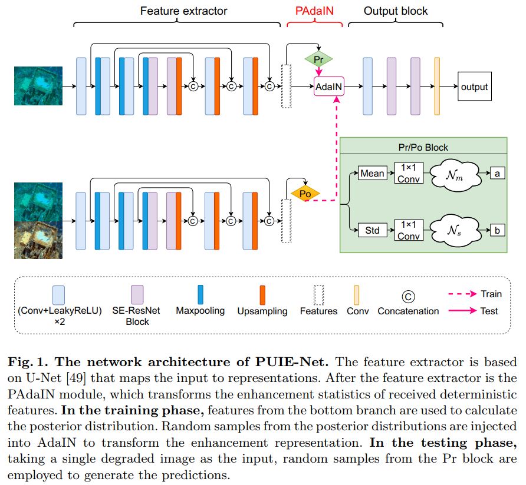

# Uncertainty Inspired Underwater Image Enhancement (ECCV 2022)([Paper](https://arxiv.org/pdf/2207.09689.pdf))
The Pytorch Implementation of ''Uncertainty Inspired Underwater Image Enhancement''. 

<div align=center></div>

## Introduction
In this project, we use Ubuntu 16.04.5, Python 3.7, Pytorch 1.7.1 and one NVIDIA RTX 2080Ti GPU. 

## Running

### Testing

Download the pretrained model [pretrained model](https://drive.google.com/file/d/1rkGm0l826ybOk_RSJNSZwbKpJc_z2ZkU/view?usp=sharing).

Check the model and image pathes in Test_MC.py and Test_MP.py, and then run:

```
python Test_MC.py
```
```
python Test_MP.py
```

### Training

To train the model, you need to prepare our [dataset](https://drive.google.com/file/d/1YXdyNT9ac6CCpQTNKP7SnKtlRyugauvh/view?usp=sharing).

Check the dataset path in Train.py, and then run:
```
python Train.py
```

## Citation

If you find PUIE-Net is useful in your research, please cite our paper:

```
@inproceedings{Fu_2022, 
	title={Uncertainty Inspired Underwater Image Enhancement}, 
	author={Fu, Zhenqi and Wang, Wu and Huang, Yue and Ding, Xinghao and Ma, Kai-Kuang}, 
	booktitle={European Conference on Computer Vision (ECCV)},
	year={2022}, 
	pages={465--482},	
}
```

